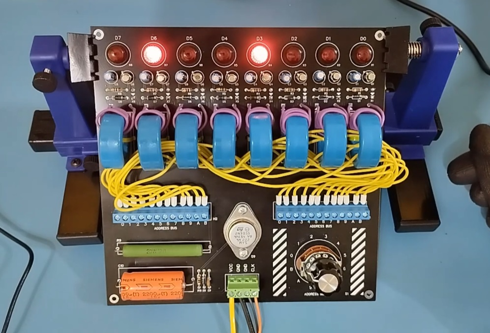

# My Core Rope Memory Module Project

This Core Rope Memory Module has 12 addresses x 8bit values (96 bits total). You can select the address by rotating a rotary switch, and the bits of the stored value will be displayed in the top lights. Its operation depends on a 12v supply and a 2khz signal with an amplitude close to 3v.

[YouTube - Main concepts (brazilian portuguese)](https://www.youtube.com/watch?v=U486-RYbadM)

[YouTube - Making of (brazilian portuguese)](https://www.youtube.com/watch?v=TnKUSDZDZGY&t=527s)

